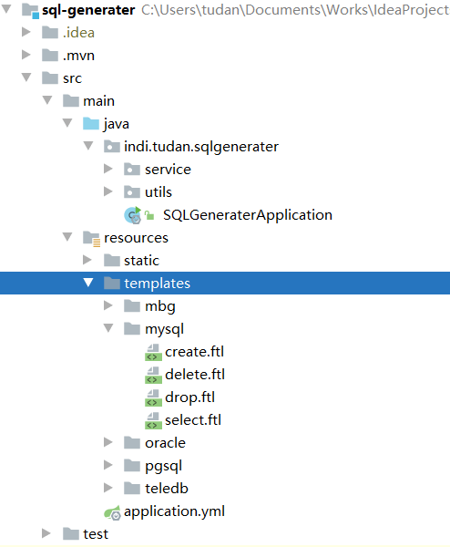

# sql-generater
根据模板生成 sql

## 项目结构图




templates 下面的文件夹是数据库方言或模板组，可以根据需要直接创建文件夹，程序会自动扫描；文件夹里面是 FreeMarker 模板，根据模板生成 DDL、DQL、DML 脚本，可以根据需要扩展，欢迎指正错误。


## 启动 indi.tudan.sqlgenerater.SQLGeneraterApplication

根据控制台提示设置配置
```shell script
=======================================================================================

根据模板 【 create.ftl 】 生成 sql

当前配置如下
数据库方言或模板组：mysql
待解析文件：C:/Users/tudan/Documents/Works/IdeaProjects/WorkLearn/sql-generater/target/classes/static/表结构设计.xlsx
输出模式：console

=======================================================================================

是否需要修改配置？(Y/N)
y
请选择需要修改的配置项序号：
1. 数据库方言或模板组（mbg, mysql, oracle, pgsql, teledb）
2. 待解析 Excel 路径
3. 模板类型（create.ftl, delete.ftl, drop.ftl, select.ftl）
4. 输出模式（console, file）
2
请输入 Excel 路径
C:/Users/tudan/Documents/Works/IdeaProjects/WorkLearn/sql-generater/target/classes/static/表结构设计.xlsx
是否需要修改配置？(Y/N)
y
请选择需要修改的配置项序号：
1. 数据库方言或模板组（mbg, mysql, oracle, pgsql, teledb）
2. 待解析 Excel 路径
3. 模板类型（create.ftl, delete.ftl, drop.ftl, select.ftl）
4. 输出模式（console, file）
3
请输入模板类型（如：create.ftl，则输入 create）
select
是否需要修改配置？(Y/N)
y
请选择需要修改的配置项序号：
1. 数据库方言或模板组（mbg, mysql, oracle, pgsql, teledb）
2. 待解析 Excel 路径
3. 模板类型（create.ftl, delete.ftl, drop.ftl, select.ftl）
4. 输出模式（console, file）
3
请输入模板类型（如：create.ftl，则输入 create）
create
是否需要修改配置？(Y/N)
n
/*建表语句*/
CREATE TABLE IF NOT EXISTS `test_1` (
            `id` bigint NOT NULL AUTO_INCREMENT COMMENT '数据唯一标识【序列，自增长】',
            `busi_date` date NOT NULL COMMENT '业务日期【示例：2019-01-01】',
            `code` char(10) NOT NULL COMMENT '编码【示例：1001】',
            `name` char(100) COMMENT '名称【示例：XX】',
            `month` char(7) NOT NULL COMMENT '月份【示例：2019-01】',
            `fee` decimal(30,2)  COMMENT '费用【单位：元】',
            `rate` decimal(10,2)  COMMENT '费用波动【单位：百分比，%】',
            `create_date` datetime NOT NULL COMMENT '统计时间（创建时间）',
        PRIMARY KEY (`id`)
) ENGINE=InnoDB DEFAULT CHARSET=utf8 COMMENT='测试表1';


/*建表语句*/
CREATE TABLE IF NOT EXISTS `test_2` (
            `id` bigint NOT NULL AUTO_INCREMENT COMMENT '数据唯一标识【序列，自增长】',
            `user_id` char(10) NOT NULL COMMENT '编码【示例：1001】',
            `user_name` char(100) COMMENT '名称【示例：XX】',
            `month` char(7) NOT NULL COMMENT '年月【示例：2019-01】',
            `create_date` datetime NOT NULL COMMENT '统计时间（创建时间）',
        PRIMARY KEY (`id`)
) ENGINE=InnoDB DEFAULT CHARSET=utf8 COMMENT='测试表2';


Disconnected from the target VM, address: '127.0.0.1:57940', transport: 'socket'

Process finished with exit code 0

```